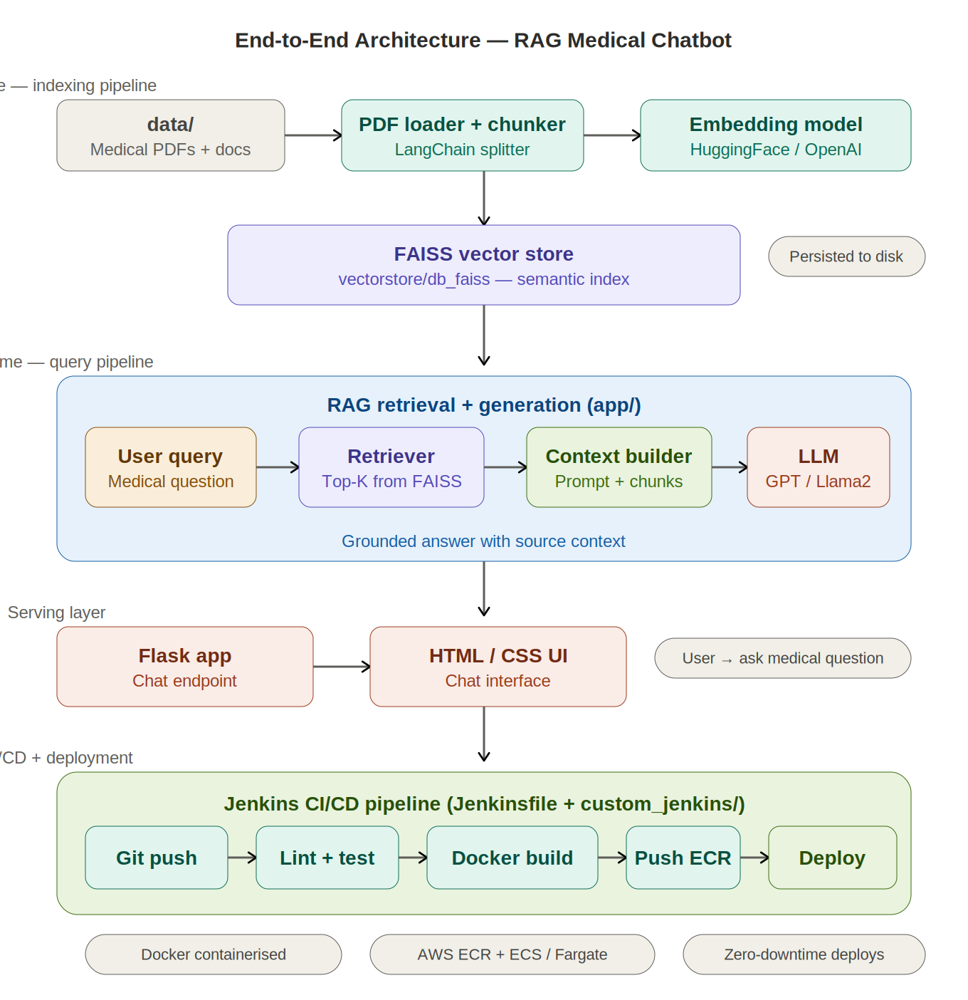

# 🔐 Network Security Threat Detection — End-to-End MLOps Pipeline

[](https://python.org)
[](https://scikit-learn.org)
[](https://mlflow.org)
[](https://mongodb.com)
[](https://docker.com)
[](https://aws.amazon.com)
[](https://github.com/features/actions)
[](LICENSE)

A **production-grade ML system** for detecting network security threats (phishing sites, malicious URLs) using URL and domain features. Built with a complete MLOps pipeline — MongoDB ETL, automated data validation, model factory with hyperparameter tuning, MLflow experiment tracking via DagsHub, batch prediction, and CI/CD deployment to AWS EC2 via GitHub Actions.

---

## 📑 Table of Contents

- [Why This Project](#-why-this-project)
- [Architecture](#-architecture)
- [Dataset & Features](#-dataset--features)
- [ML Models & Approach](#-ml-models--approach)
- [Tech Stack](#-tech-stack)
- [Pipeline Components](#-pipeline-components)
- [Project Structure](#-project-structure)
- [Getting Started](#-getting-started)
- [MLflow Tracking](#-mlflow-tracking)
- [CI/CD & Deployment](#-cicd--deployment)
- [Results & Metrics](#-results--metrics)
- [Future Improvements](#-future-improvements)

---

## 🎯 Why This Project

Phishing attacks and malicious URLs are among the most common network security threats. Detecting them in real time requires a system that goes beyond a trained model — you need automated ETL from a data store, data validation to catch schema drift, experiment tracking to compare approaches, batch prediction for scoring new data, and CI/CD for continuous deployment. This project builds the **complete MLOps lifecycle** for network threat detection, demonstrating production engineering practices alongside ML.

---

## 🏗 Architecture



**Pipeline Flow:** MongoDB (network traffic data) → ETL pipeline with validation → Feature transformation (encoding, scaling) → Model training with GridSearchCV across multiple classifiers → MLflow experiment tracking on DagsHub → Model evaluation (F1, precision, recall) → Batch prediction pipeline → Flask API serving → Docker containerised → GitHub Actions CI/CD → AWS ECR → EC2 deployment.

---

## 📊 Dataset & Features

The dataset contains URL and domain features commonly used to identify phishing and malicious websites.

| Feature Category | Examples | Type |
|---|---|---|
| **URL structure** | `having_IP_Address`, `URL_Length`, `Shortening_Service` | Binary / Integer |
| **Domain properties** | `age_of_domain`, `DNS_Record`, `Domain_registration_length` | Integer / Binary |
| **Security indicators** | `SSLfinal_State`, `HTTPS_token`, `Request_URL` | Binary / Ordinal |
| **Redirect & iframe** | `Redirect`, `on_mouseover`, `Iframe` | Binary |
| **Traffic signals** | `web_traffic`, `Google_Index`, `Page_Rank` | Integer / Binary |
| **Target** | `Result` — Phishing (1) or Legitimate (-1) | Binary |

**Problem type:** Binary classification — predict whether a URL/site is phishing or legitimate based on structural, domain, and security features.

---

## 🤖 ML Models & Approach

### Model Factory

The pipeline trains and compares multiple classifiers using `GridSearchCV`:

| Model | Type | Strengths for This Task |
|---|---|---|
| **Random Forest** | Bagging ensemble | Handles mixed feature types, robust to noise in URL features |
| **Gradient Boosting** | Sequential boosting | Strong on tabular data, captures complex feature interactions |
| **XGBoost** | Optimised boosting | Fast training, built-in regularisation, handles class imbalance |
| **SVM** | Kernel-based | Effective with high-dimensional URL feature space |

### Feature Transformation Pipeline

| Step | Technique | Purpose |
|---|---|---|
| **Validation** | Schema checks + drift detection | Ensure new data matches expected structure |
| **Imputation** | KNN / median imputer | Handle missing values in domain age, traffic features |
| **Encoding** | Label / ordinal encoding | Convert categorical security indicators to numerical |
| **Scaling** | StandardScaler | Normalise features for SVM and distance-based methods |

### Evaluation

The model is evaluated using F1 score, precision, recall, and accuracy — with emphasis on **recall** (catching as many phishing sites as possible is more important than avoiding false positives in a security context).

### Key ML Libraries

- **scikit-learn** — Model training, preprocessing, GridSearchCV, evaluation
- **XGBoost** — Gradient boosted classifier
- **MLflow** — Experiment tracking (parameters, metrics, model artifacts)
- **DagsHub** — Remote MLflow server + model versioning
- **pandas / NumPy** — Data manipulation
- **pymongo** — MongoDB driver

---

## 🛠 Tech Stack

### ML & Data

| Tool | Role |
|---|---|
| **Python 3.8+** | Core language |
| **scikit-learn** | Model training, preprocessing, GridSearchCV, metrics |
| **XGBoost** | Gradient boosted classifier |
| **MLflow** | Experiment tracking — logs params, metrics, model artifacts |
| **DagsHub** | Remote MLflow tracking server |
| **MongoDB** | Source data store — network traffic records |
| **pandas / NumPy** | Data manipulation |

### Application & Serving

| Tool | Role |
|---|---|
| **Flask** | Prediction API endpoint |
| **Training pipeline** | Full retrain orchestration (ETL → validate → transform → train → evaluate) |
| **Batch prediction** | Score new network data in bulk |

### Infrastructure & DevOps

| Tool | Role |
|---|---|
| **Docker** | Containerises the application |
| **AWS ECR** | Container image registry |
| **AWS EC2** | Hosts the deployed application |
| **GitHub Actions** | CI/CD — auto-deploy on push to `main` |
| **Git / GitHub** | Version control |

---

## 🔄 Pipeline Components

### Training Pipeline

Orchestrates the full training lifecycle in sequence:

1. **Data Ingestion** — Connect to MongoDB, extract network traffic data, split into train/test
2. **Data Validation** — Verify schema, check column types, detect data drift
3. **Data Transformation** — Apply encoding, scaling, imputation; save preprocessing artifacts
4. **Model Training** — Run model factory with GridSearchCV, select best model
5. **Model Evaluation** — Log metrics to MLflow, compare against previous runs
6. **Model Pusher** — Save best model artifacts for serving

### Batch Prediction Pipeline

Scores new network traffic data using the trained model:

1. Load new data from source
2. Apply saved preprocessing pipeline
3. Run inference with trained model
4. Output predictions (phishing / legitimate) with confidence scores

---

## 📁 Project Structure

```
NetworkSecurity_End2End/
├── networksecurity/
│   ├── components/
│   │   ├── data_ingestion.py        # MongoDB → CSV → train/test split
│   │   ├── data_validation.py       # Schema checks + drift detection
│   │   ├── data_transformation.py   # Encoding, scaling, imputation
│   │   ├── model_trainer.py         # Model factory + GridSearchCV
│   │   └── model_evaluation.py      # Metrics + MLflow logging
│   ├── entity/
│   │   ├── config_entity.py         # Dataclass configs per stage
│   │   └── artifact_entity.py       # Dataclass artifacts per stage
│   ├── pipeline/
│   │   ├── training_pipeline.py     # Full training orchestration
│   │   └── batch_prediction.py      # Score new data
│   ├── exception/                   # Custom exception handling
│   ├── logger/                      # Structured logging
│   ├── utils/                       # Shared utilities
│   └── constants/                   # Paths, config constants
├── .github/
│   └── workflows/
│       └── main.yaml                # GitHub Actions CI/CD workflow
├── assets/                          # Architecture diagram
│   └── architecture.png
├── app.py                           # Flask prediction endpoint
├── Dockerfile                       # Container build definition
├── requirements.txt                 # Python dependencies
├── setup.py                         # Package setup
└── README.md
```

---

## 🚀 Getting Started

### Prerequisites

- Python 3.8+
- MongoDB instance with network traffic dataset
- OpenAI API key (if using DagsHub MLflow)
- Docker (for containerised deployment)
- AWS account (for ECR/EC2 deployment)

### Local Development

```bash
# 1. Clone the repo
git clone https://github.com/nishantrv/NetworkSecurity_End2End-Deployment-Docker-ECR-EC2-MLFlow-GithubAction-.git
cd NetworkSecurity_End2End-Deployment-Docker-ECR-EC2-MLFlow-GithubAction-

# 2. Create virtual environment
python -m venv venv
source venv/bin/activate

# 3. Install dependencies
pip install -r requirements.txt

# 4. Set environment variables
export MONGODB_URL="mongodb+srv://<username>:<password>@<cluster>.mongodb.net/"
export MLFLOW_TRACKING_URI="https://dagshub.com/<username>/<repo>.mlflow"
export MLFLOW_TRACKING_USERNAME="<dagshub-username>"
export MLFLOW_TRACKING_PASSWORD="<dagshub-token>"

# 5. Run the training pipeline
python -m networksecurity.pipeline.training_pipeline

# 6. Launch the Flask API
python app.py
# API available at http://localhost:8080
```

---

## 📊 MLflow Tracking

Every training run is logged to MLflow (hosted on DagsHub):

- **Parameters** — model type, hyperparameters, data split ratio
- **Metrics** — F1 score, precision, recall, accuracy per model
- **Artifacts** — trained model, preprocessing pipeline, evaluation reports

View experiments at your DagsHub repo's MLflow tab, or locally:

```bash
mlflow ui --port 5001
```

---

## ☁️ CI/CD & Deployment

### GitHub Actions Workflow (`.github/workflows/main.yaml`)

```
Push to main → GitHub Actions triggers
    │
    ├── 1. Checkout code
    ├── 2. Configure AWS credentials
    ├── 3. Login to ECR
    ├── 4. Docker build + tag
    ├── 5. Push image to ECR
    └── 6. SSH into EC2 → pull image → run container
```

### GitHub Secrets Required

```
AWS_ACCESS_KEY_ID
AWS_SECRET_ACCESS_KEY
AWS_DEFAULT_REGION
AWS_ECR_LOGIN_URI
ECR_REPOSITORY_NAME
MONGODB_URL
MLFLOW_TRACKING_URI
MLFLOW_TRACKING_USERNAME
MLFLOW_TRACKING_PASSWORD
```

### EC2 Setup

```bash
sudo apt-get update -y
curl -fsSL https://get.docker.com -o get-docker.sh
sudo sh get-docker.sh
sudo usermod -aG docker ubuntu
newgrp docker
```

## 🤝 Contributing

Contributions and feedback are welcome! Feel free to open an issue or submit a pull request.

---

## 📄 License

This project is licensed under the MIT License — see the [LICENSE](LICENSE) file for details.

---

**Built by [Nishant Ranjan Verma](https://github.com/nishantrv)** | Dublin, Ireland